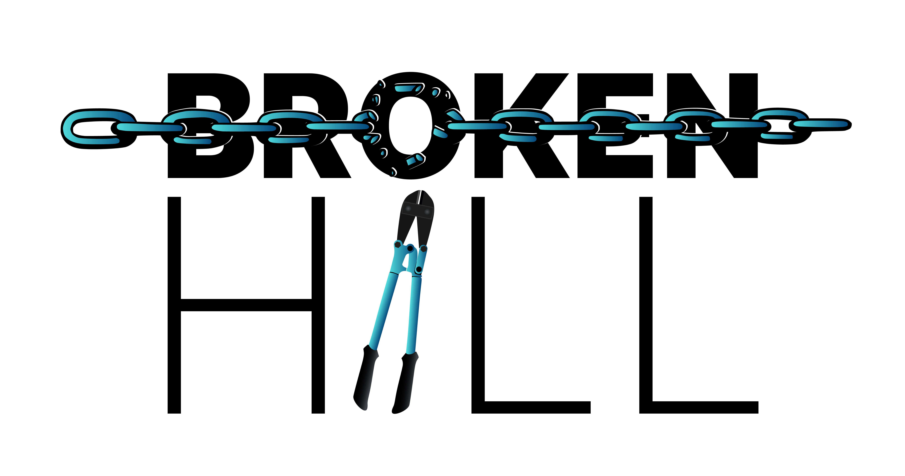

# Broken Hill

Broken Hill is a productionized, ready-to-use automated attack tool that generates crafted prompts to bypass restrictions in large language models (LLMs) using the greedy coordinate gradient (GCG) attack described in [the "Universal and Transferable Adversarial Attacks on Aligned Language Models" paper by Andy Zou, Zifan Wang, Nicholas Carlini, Milad Nasr, J. Zico Kolter, and Matt Fredrikson](https://arxiv.org/abs/2307.15043).

Broken Hill can generate robust prompts that successfully jailbreak LLMs configured differently than the one used to generate the prompts. For example:

* The same model with more or fewer parameters
  * e.g. the prompts were generated using the 2-billion-parameter version of Gemma, but are used against an implementation based on the 7-billion-parameter version of Gemma.
* The same model with weights quantized to different types
  * e.g. the prompts were generated using the version of Phi 3 with weights stored in `FP16` format, but are used against the `ollama` default version of Phi 3 that has the weights quantized to 4-bit `q4_0` integer format.
* The same model, but with different randomization settings
  * e.g. a non-default temperature or random seed.
* Potentially even a different model than the one used to generate the prompts

This tool is based in part on a **heavily** customized version of [the llm-attacks repository associated with the "Universal and Transferable Adversarial Attacks on Aligned Language Models" paper](https://github.com/llm-attacks/llm-attacks/). It also incorporates a few algorithms from [nanoGCG](https://github.com/GraySwanAI/nanoGCG).

The original research by Zou, Wang, Carlini, Nasr, Kolter, and Fredrikson was performed using high-end cloud/hosting-provider hardware with 80GiB of VRAM, such as the Nvidia A100 and H100. Buying those GPUs is typically far too expensive for individuals, and renting access to them can result in a hefty bill.

Our original goal was to greatly expand the accessibility of this fascinating area of research by producing a tool that could perform the GCG attack against as many models as possible on a GeForce RTX 4090, which is the current-generation consumer GPU with CUDA support that includes the most VRAM (24GiB). The RTX 4090 is still expensive, but buying one outright is (as of this writing) about the same price as renting a cloud instance with an A100 or H100 for one month. Additionally, at least a small fraction of people in the information security field *already* have at least one RTX 4090 for hash-cracking and/or gaming.

As of version 0.34, Broken Hill can also perform processing on devices without CUDA hardware at an acceptable rate (although reduced from the performance CUDA hardware provides), and can even be used on Mac OS and Windows (although it is primarily tested on Linux). This allows the attack to be performed by a much larger audience, and against much larger models than previous versions allowed.

## Documentation

[Documentation for Broken Hill is in its own directory tree due to the volume of material](docs/README.md).

[Broken Hill version history](version_history.md)

[A high-level blog post introducing Broken Hill](https://bishopfox.com/blog/brokenhill-attack-tool-largelanguagemodels-llm)

[Broken Hill tool page at BishopFox.com](https://bishopfox.com/tools/broken-hill)

## Features

* Extensive command-line interface
* Supports numerous model families, many of which are available in sizes small enough to run on an RTX 4090 ([see the "Model notes" document for specific details](docs/GCG_attack/model_notes.md)). Some highlights:
  * Azurro's APT family
  * Falcon
  * Gemma (including third-party derivatives, such as `Vikhr-Gemma-2B-instruct`)
  * Gemma 2
  * GLM-4
  * GPT-J, GPT-Neo, and GPT-NeoX
  * Guanaco
  * Llama (including third-party derivatives such as `Llama-68M-Chat-v1` and `alpaca-13b`)
  * Llama-2 (including first- and third-party derivatives, such as Meta-Llama-Guard-2, Swallow, and Youri)
  * Llama-3 (including first- and third-party derivatives, such as Llama-Guard-3, Swallow, and Youko)
  * MPT
  * Mamba
  * Mistral (including derived third-party models such as Intel's Neural Chat)
  * Mixtral
  * OPT
  * Orca-2
  * Phi-1 through Phi-3.5
  * Pythia (including derived third-party models such as the Pythia-based subset of the OpenAssistant models)
  * Qwen 1, 1.5, and 2 (including third-party derivatives, such as `nekomata-7b-instruction`)
  * RedPajama-INCITE
  * SOLAR
  * SmolLM
  * Snowflake Arctic
  * StableLM 1 and 2
  * TinyLlama
  * Vicuna
* Results can be output in JSON format for filtering/analysis
* Supports testing each iteration of adversarial data against the same LLM with multiple different randomization settings, to help weed out fragile results
* Automatic state backup at each iteration, allowing resuming from a checkpoint if an error is encountered, or continuing to perform additional iterations after a test ends.
* Features self-tests to help validate that that the attack is configured correctly and will produce useful results
  * Validation that conversations are provided in the format the model was trained for
  * Validation that the model does not provide the requested output when no adversarial content is included
  * Validation that the model provides the requested output when given a prompt that simulates the ideal result of a GCG attack
* Additional techniques for guiding the course of adversarial content generation beyond loss value
  * Roll back to high-water-mark results based on jailbreak count
  * Require that the loss value meet (or be close to) previous results
* The ability to specify custom jailbreak detection rules in JSON format, to make detection more accurate for test cases
  * Improved jailbreak detection rules for the default method developed by Zou, Wang, Carlini, Nasr, Kolter, and Fredrikson
* Optional pre-configured denylists to help avoid generating adversarial results that contain slurs, profanity, etc.
* Filtering and other controls to improve the results
* Numerous experimental options to test variations on the GCG attack
* A bunch of other stuff

## Planned for future releases

* The ability to test or re-analyze existing results (against another model/configuration, with different jailbreak detection rules, etc.)
  * Would allow more straightforward discovery of "transferrable" adversarial content
  * Would allow results to be tested against models that will fit into device memory, even when the data necessary for the GCG attack (gradient, backpropagation data, etc.) will not
  * Would allow revised jailbreak detection rules to be tested without the overhead of rerunning the content generation
* More extensive self-tests to further refine conversation templates
* More flexible rollback model
* Configurable randomization rules to help generate more unique variations ("Gamma garden mode")
* Built-in features to output result data for follow-on work (versus using `jq` in the current version)
* Improved default jailbreak detection logic
* Additional loss algorithm(s)
* The ability to operate a cluster of systems running Broken Hill coordinated by a central node
* Additional attack modes
* Internationalization
