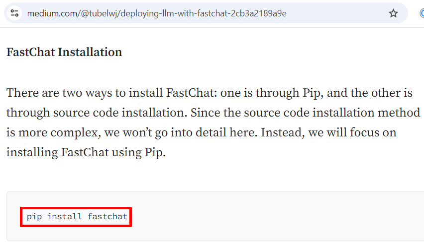
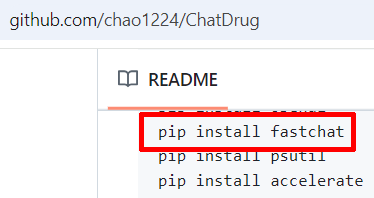
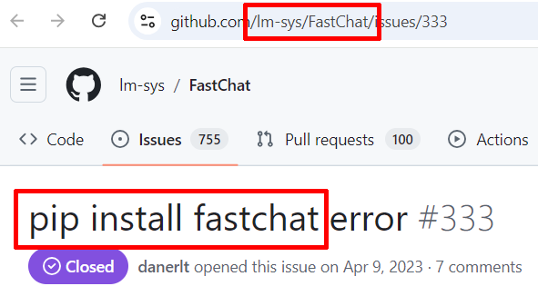
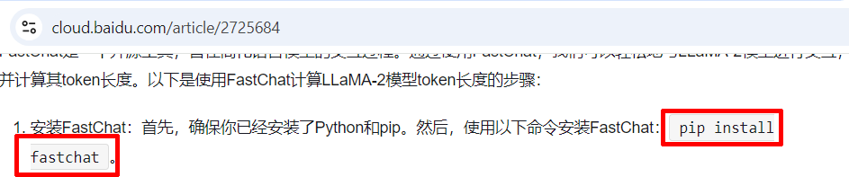

# On the naming of FastChat's `fschat` (AKA `fastchat` in some contexts) Python library

[There's a really handy Python library that provides functionality related to formatting conversations in the ways that different LLMs expect](https://github.com/lm-sys/FastChat).

[The original llm-attacks repository published by the authors of the "Universal and Transferable Adversarial Attacks on Aligned Language Models" paper uses that library](https://github.com/llm-attacks/llm-attacks/), and as a result, so does Broken Hill.

The authors of that library refer to it as "FastChat". The import statement for the library in Python is `import fastchat`. Essentially everyone on the internet refers to it as "FastChat". So why does all of the documentation for Broken Hill refer to it as `fschat`?

Because [the PyPi package name for the library is actually `fschat`](https://pypi.org/project/fschat/), meaning that to "install FastChat", one runs a command like this:

```
bin/pip install fschat
```

It would be very easy for one to assume that when one downloads a Python script that contains a line like this:

```
import fastchat
```

...and one sees an error like this when running the script:

```
$ python cool_script_that_make_your_dreams_come_true_or_something.py

Traceback (most recent call last):
  File "/home/kali/cool_script_that_make_your_dreams_come_true_or_something.py", line 3, in <module>
    import fastchat
ModuleNotFoundError: No module named 'fastchat'

```

...and especially because essentially every internet source that discusses this topic refers to "installing FastChat" or similar, that the way to fix that error is to run the following command **and - spoiler - you absolutely should *not* run this command**: 

```
bin/pip install fastchat
```

Why should you not run that command? Because it will install [an extensively modified fork of an old release of the `fschat` library released by someone with no relation to the "FastChat" project](https://pypi.org/project/fastchat/).

If one executes the command `pip install fastchat`, then `python cool_script_that_make_your_dreams_come_true_or_something.py`, Python will execute whatever code happens to be in that random unsupported fork of `fschat`. Is it good? Is it bad? Will it install a cryptominer on your system or delete all of your files? Who knows?

The "Homepage" link in that PyPi entry is invalid. The email address is a random Gmail account. If one searches for the email address, one will eventually locate [what appears to be the GitHub profile of the person responsible for the fork](https://github.com/linkedlist771), and that profile contains a completely different invalid link to a nonexistent homepage. None of these locations contained a real name or information on who had published the forked code at the time of this writing.

This situation is so dangerously confusing that at the time of this writing, [even *Microsoft* had documentation instructing users to install the modified fork of `fschat`](https://huggingface.co/datasets/microsoft/Taskbench):


...but Microsoft's document was far from alone:












I think this is extremely troubling. It would be a great way to mount a supply chain attack against a popular new technical field, either through the initial creation of the fork, or by waiting for the fork to be abandoned and then assuming ownership over it.

Personally, I feel that PyPi should enforce a rule that the name used to import a package must match the name used to install the package.
